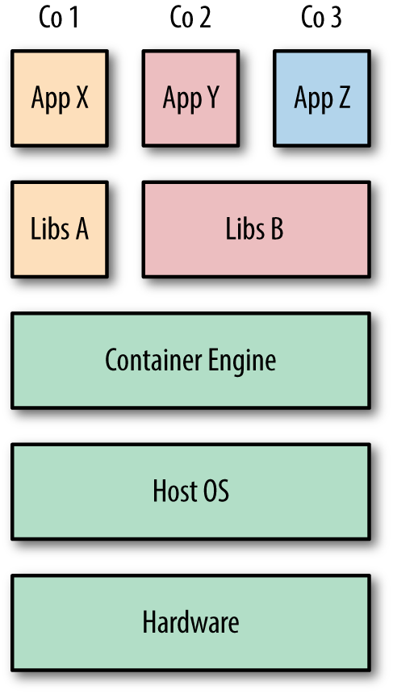

<h2>Containerization</h2>
Containers are fundamentally changing the way we develop, distribute, and run software. Developers can build software locally, knowing that it will run identically regardless of host environment—be it a rack in the IT department, a user’s laptop, or a cluster in the cloud. Operations engineers can concentrate on networking, resources, and uptime and spend less time configuring environments and battling system dependencies. The use and uptake of containers is increasing at a phenomenal rate across the industry, from the smallest start ups to large-scale enterprises. Developers and operations engineers should expect to regularly use containers in some fashion within the next few years.

Containers are an encapsulation of an application with its dependencies. At first glance, they appear to be just a lightweight form of virtual machines (VMs)—like a VM, a container holds an isolated instance of an operating system (OS), which we can use to run applications.

However, containers have several advantages that enable use cases that are difficult or impossible with traditional VMs:

Containers share resources with the host OS, which makes them an order of magnitude more efficient. Containers can be started and stopped in a fraction of a second. Applications running in containers incur little to no overhead compared to applications running natively on the host OS.

The portability of containers has the potential to eliminate a whole class of bugs caused by subtle changes in the running environment—it could even put an end to the age-old developer refrain of “but it works on my machine!”

The lightweight nature of containers means developers can run dozens of containers at the same time, making it possible to emulate a production-ready distributed system. Operations engineers can run many more containers on a single host machine than using VMs alone.

Containers also have advantages for end users and developers outside of deploying to the cloud. Users can download and run complex applications without needing to spend hours on configuration and installation issues or worrying about the changes required to their system. In turn, the developers of such applications can avoid worrying about differences in user environments and the availability of dependencies.

More importantly, the fundamental goals of VMs and containers are different—the purpose of a VM is to fully emulate a foreign environment, while the purpose of a container is to make applications portable and self-contained.

<h2>Containers Versus VMs:</h2>

Though containers and VMs seem similar at first, there are some important differences, which are easiest to explain using diagrams.
 shows three applications running in separate VMs on a host. The hypervisor1 is required to create and run VMs, controlling access to the underlying OS and hardware as well as interpreting system calls when necessary. Each VM requires a full copy of the OS, the application being run, and any supporting libraries.


 In contrast, the image below shows that how the same three applications could be run in a containerized system. Unlike VMs, the host’s kernel is shared with the running containers. This means that containers are always constrained to running the same kernel as the host. Applications Y and Z use the same libraries and can share this data rather than having redundant copies. The container engine is responsible for starting and stopping containers in a similar way to the hypervisor on a VM. However, processes running inside containers are equivalent to native processes on the host and do not incur the overheads associated with hypervisor execution.
 Both VMs and containers can be used to isolate applications from other applications running on the same host. VMs have an added degree of isolation from the hypervisor and are a trusted and battle-hardened technology. Containers are comparatively new, and many organizations are hesitant to completely trust the isolation features of containers before they have a proven track record. For this reason, it is common to find hybrid systems with containers running inside VMs in order to take advantage of both technologies.
 


Here, our choice for containerization is *Docker*

<h2>Orchestration</h2>:
organizations often have multiple such systems to run, or need to run occasional tasks such as data mining that are separate from the main system, but require significant resources or talk to the existing system.

When using multiple resources, it is important to make sure they are efficiently used—not sitting idle—but can still cope with spikes in demand. Balancing cost-effectiveness against the ability to quickly scale is A difficult task that can be approached in a variety of ways.

All of this means that running a nontrivial system is full of administrative tasks and challenges, the complexity of which should not be underestimated. It quickly becomes impossible to look after machines on an individual level; rather than patching and updating machines one by one they must be treated identically. When a machine develops a problem, it should be destroyed and replaced, rather than nursed back to health

A solution to this problem is *Orchestration* which basically means making all the pieces work together. Starting containers on appropriate hosts and connecting them. An orchestration system may also include support for scaling, automatic failover, and node rebalancing. We decided to use *Swarm* here

<h3>Swarm</h3>
Swarm is the native clustering tool for Docker. Swarm uses the standard Docker API, i.e., containers can be launched using normal docker run commands and Swarm will take care of selecting an appropriate host to run the container on. This also means that other tools that use the Docker API—such as Compose and bespoke scripts—can use Swarm without any changes and take advantage of running on a cluster rather than a single host.

Our first step here is to provide an internet free from all of the sanctions against us here in Iran so I chose Shecan to tackle this very issue , so you have to add your nameserver on top of the specified file `/etc/resolve.conf`

```
vi /etc/resolve.conf
nameserver 178.22.122.100
```

Docker installation:
There is a script for that provided by docker which makes installing docker as a piece of cake, you just have to download and execute it.

```
curl -fsSL https://get.docker.com -o get-docker.sh
sh get-docker.sh
```

Start docker service and enable it & enter the token for workers to join swarm

```
systemctl start docker
systemctl enable docker
```

Docker swarm initilization as master node:
This command initialize a swarm. The docker engine targeted by this command becomes a manager in the newly created single-node swarm. Masters are like symphony orchestrator - with the difference that they can also play music - and workers are the players themselves.

```
docker swarm init
docker swarm join --token [BLUH BLUH] 37.152.183.225:2377
```


Because we simply does not want to isolate DB node from the rest and there is no affinity and anti affinity capabality in swarm ,
I just labled nodes as database and wordpress node. So based on to these labels placement will be performed

```
sudo docker node update --label-add database=true [nodename]
sudo docker node update --label-add wordpress=true [nodename]
```

We need to share a volume between wordpress replicas in order to view the same content whenever we connect to each one of them so we need a solution for that because by default docker volumes use local driver which means that every node will only have access to their local storage drive , there are three ways to tackle this problem
1. NFS 
2. Gluster FS
3. CEPH
For the sake of simplicity we won't go with the last option and we choose the 2nd one to shed more light on the matter at hand Gluster is a scalable, distributed file system that aggregates disk storage resources from multiple servers into a single global namespace.

In order to mimic the production environment I made a 1 GB disk and added it to my VM

A. list the attached disks using and find the new disk that you've created

```
lsblk
```

B. Add a new partition using 

```
fdisk /dev/vdb
```

Here since we are creating a partition use `n` option.
Enter `p` to create either primary/extended partitions. By default we can have upto 4 primary partitions.
For three upcoming fields just hit `enter key`
Hit `w` key to save the changes and exit.


C. Make the file system through `mkfs.xfs`
D. create this directory on all nodes

```
mkdir -p /data/brick/sharedv 
```
E. Mount the disk on boot through the command below

```
echo '/dev/vdb1 /data/brick/sharedv xfs defaults 1 2' >> /etc/fstab
```

F. Mount the disk and see if there is any error

```
mount -a && mount
```

G. Now you need to install the centos-release-gluster RPM as it will provide the required YUM repository files. yum install centos-release-gluster 

```
yum install glusterfs-server
systemctl start glusterd
systemctl enable glusterd
```

H. on each node edit `etc/hosts` and add `127.0.0.1 [hostname]`
For example on router-1 node you should add `127.0.0.1 router-1`
I. if there is a pool of disk servers use this command for each server with their hostnames

```
gluster peer probe server1
```

J. Set up a GlusterFS volume

```
gluster volume create gv0 replica 2 router-1:/data/brick/sharedv/ server-1:/data/brick/sharedv/ force
gluster volume start gv0
gluster volume info #confirm the output by using this command
R.mount -t glusterfs router-1:/data/brick1/gv0 /mnt/glusterfs
```

Deploy the stack using 

```
docker stack deploy -c [yaml location] [stack name]
```


Tip : there is no sticky session in the provided scenario which basically means if you login to your wordpress account whenver you are redirected to the other container you will have to login again in docker swarm as an option - because swarm do the load balancing in layer 4- therefore in order to initiate sticky ones we need a reverse proxy such as nginx or traefik would do the job .
